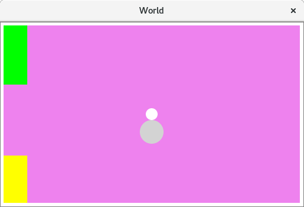

As a professional software developer, and with my older daughter Lara being 11 years
old, and the second one Kristina 8, I figured it made sense to spend some time trying
to introduce them to programming. My father introduced me to it at a slightly
later age, but still relatively early (it was some BASIC dialect at the time).

After some research I decided to eschew the usual choice of
[Scratch](https://en.wikipedia.org/wiki/Scratch_(programming_language))
because I thought it too imperative, not emphasizing enough programming as
composition of smaller pieces, and not being something you can easily grow
from to more classical programming languages. I may have been wrong on this, I
confess that I didn't spend as much time researching `Scratch` as I should have.

I've spent some time considering which language to use, but it was a true
coincidence that I was listening one day to the Functional Geekery podcast
[interview of Conrad Barski](https://www.functionalgeekery.com/episode-38-dr-conrad-barski/),
where he mentioned his [Land of Lisp](http://landoflisp.com/) book, and its
[Realm of Racket](http://www.realmofracket.com/) sequel.
I've had the wish to learn a `lisp` for some time, and I'm also biased towards
more functional languages and approaches (FP). So I bought the  book,
which was a great source of inspiration. I also ordered a Scratch book at the
same time, but I actually never opened it, because it became quickly clear to
me that racket was going to be the one.

The racket language, as a `scheme` dialect (itself a `lisp` dialect), seems like
a great fit for teaching children:

* very little syntax
* no keywords, translate-able (see below)
* very good libraries and material for teaching, like [HtDP](http://www.htdp.org/)
* a REPL and the DrRacket IDE

In addition the `Realm of Racket` book is built around the idea of building
increasingly complex games to introduce children to programming, which I thought
was a great approach.

For older children with some experience in mathematics, I would actually
consider `haskell`, but at this age I think `racket` is a great option.

We worked through weekly ~1h sessions through the summer, with little or no
material prepared ahead of time. Most of the time I would write the skeleton of
the code and ask them to modify it to achieve the function. Children were not
independently writing code from scratch. Due to that, it's a question
how much programming they actually learned. We did work on their geometry
skills when working on the game, at the very least.

I don't claim to have achieved anything better than if we had went with
`Scratch`. Maybe it would have been a better choice in the end. I don't know
Scratch enough to make a judgment on that.

I've put slightly edited versions of the source code we've produced
[on github](https://www.github.com/emmanueltouzery/racket-summer-programming/).

## Getting ready

When I picked `racket` as a teaching language, I didn't know it myself. To prepare
myself, I wrote
[a tetris-like game in racket](https://github.com/emmanueltouzery/racket-blocks).
It worked out well enough that I was convinced that was the way forward also for
my teaching plans.

## Prerequisites

Racket's standard library functions are obviously named in english. I decided to try as
much as possible to translate function names to Slovenian, which is the language
my children are fluent in. Something like that would be impossible in many
traditional languages, but it's no problem do it in `racket` (well, [I still had to
ask](http://stackoverflow.com/questions/35976538/)).
Thanks to this, the core `scheme` function `define` became `naj-bo`, `if` became
`če`, and so on. I also [translated](https://github.com/emmanueltouzery/racket-summer-programming/blob/master/slovensko/slovenscina.rkt)
many library function names.

An issue that turned up with that though, was that error messages (compile errors) would
still come up in english, and were then even more baffling to children than they
would be otherwise (you can't relate to an '`undefined`' error message if you
didn't actually use '`define`' in the first place..).

When I'll give example code from now on, I'll use english, but we did actually
type it in Slovenian with the children.

## Beginnings

We started the first session by playing with the REPL in DrRacket, so performing basic
arithmetic and viewing the results. So, expressions like `(+ 1 2)`, also
defining variables, like creating a variable for each their names having
as value their age, and calculating the age difference:

```scheme
(define lara 11)
(define kristina 8)
(- lara kristina) ;; age difference
(define year 2016)
(- year lara) ;; birth year
```

They would then create such variables for other family members, and computing
age differences or even sums, then we would look at nested expressions like
`(/ (+ 6 4) 2)` (which is (6+4)/2). Thanks to the interactivity of the REPL,
what could be very confusing was not that problematic in the end.

We then moved to the first exercise from the `Realm of Racket` book: guess the
number. The player picks a number between 0 and 100, the computer must guess it,
the player answers with 'too high', 'too low' until the computer finds the number.
The insight is to write the app relying entirely on the REPL: you communicate
with the computer by calling functions, so no need for mechanisms to parse
user input for instance.

A first implementation looks like that:

```scheme
#lang racket

(define minimum 0)
(define maximum 100)

;; guess => try the middle of the interval
;; quotient is integer division
(define (guess)
  (quotient (+ minimum maximum) 2))

;; set! overwrites a value
;; sub1 subtracts 1
;; => overwrite the maximum to become guess-1
;;    and then guess again
(define (smaller)
  (set! maximum (sub1 (guess)))
  (guess))

;; add1 adds 1
;; => overwrite the minimum to become guess+1
;;    and then guess again
(define (bigger)
  (set! mininum (add1 (guess)))
  (guess))
```

This is actually simplified from the book, removing some subtleties to stick the
minimum more or less working solution.

A session of playing this game looks like that (again, example from the book):

```scheme
> (guess)
50
> (bigger)
75
> (smaller)
62
> (smaller)
56
```

The hardest thing here was explaining the binary search algorithm. But they
got it, it's pretty intuitive in the context of guessing a number. They quickly
understood that picking the number in the middle of the interval would get
the result faster, although of course their first plan was to try 1, then 2,
and so on.

Regarding the implementation, while I'm not a great fan of the mutation, it's
pretty concise, and the game was a great success with the kids.
We proceeded to expand it, changing the range of numbers, and also detecting
when we knew we won (when upper is equal to lower) -- an idea of the kids.

At that point it was mostly me changing the application itself, but I would ask
the children what part of the program should be changed to achieve the new
feature, and what exactly would they change. We would try every suggestion
from the children, including those that were obviously not going to work, so
that they could see the effects of the changes by themselves. I think that was
an important aspect, that they could grasp this sense of interactivity and
control.

Then I would slowly have them make the changes themselves and try them out.

# Graphics

One of the articles that inspired me preparing the plan for the graphics was
[that one about the CodeWorld teaching language](https://cdsmith.wordpress.com/2016/05/22/codeworlds-big-decisions/),
and in particular this paragraph:

> Another change here was originally an accident.  CodeWorld, from the beginning,
> did not implement using any kind of image file in a program.  Originally,
> this was because I hadn’t bothered to implement a UI for uploading assets to
> use in the web-based programs!  But after teaching with it, I don’t regret it
> at all.  I’ve had other teachers tell me the same thing.  By giving students
> only geometric primitives, not images copied and pasted from the web, as the
> tools for their projects, they are more creative and work with a lot more
> mathematics in the process.

So I also decided to forgo images and have all drawings being combinations
of basic primitives (triangles, rectangles, circles...).
Our first exercise was some drawing, and halfway through it we came up together
with the children to the idea of our hero being a snowman. Being drawn as two
circles, it was a perfect match.

## Drawing our hero

I found the style in `Realm of Racket` to be excessively using mutation and
local `define` calls, so I did introduce the
[threading macros](http://lexi-lambda.github.io/threading/threading.html)[^threading],
explaining just that they help chaining calls.

So our first graphical program drew our snowman:

```scheme
#lang racket

(require 2htdp/image)
(require threading)

(~> (rectangle 100 100 "solid" "blue")
    (place-image/align
     (circle 20 "solid" "white") 30 60 "left" "top" _)
    (place-image/align
     (circle 10 "solid" "white") 40 40 "left" "top" _))
```


To draw our snowman, I prepared the code to draw the background rectangle and
the lower circle, then asked the children to modify the program to draw the
second circle in the right position and at the right size. Their success showed
that they had at least some understanding of the program structure and of the
geometry involved. Thank you `CodeWorld`!

Also thumbs up to DrRacket for displaying pictures in the REPL output!

## The Big Bang

After drawing, we could move to the next step: animating! This is where the
killer application for `racket` for teaching comes up: the
[big-bang](https://docs.racket-lang.org/teachpack/2htdpuniverse.html#%28form._world._%28%28lib._2htdp%2Funiverse..rkt%29._big-bang%29%29)
function.
Big bang, part of the "How to Design Programs" suite, guides the developer in
organizing the application's state in a single structure, then providing functions
to evolve that state when the following events (or many other types of events) occur:

* time passing
* keyboard/mouse events
* endgame detection

So all you need for a functional game is an initial state, a drawing function
taking the state, and functions to transform the state when any of those events
occur.

The first obvious program we built was to have the snowman fall on the display.
Our state is a single integer: the y position of the snowman, and it
increases with time.
We also modify our existing `snowman` function to take as a parameter the
vertical offset at which to draw.

```scheme
#lang racket

(require 2htdp/image 2htdp/universe)
(require threading)

;; the snowman function now takes the Y offset as parameter
(define
 (snowman position)
 (~> (rectangle 500 300 "solid" "blue")
     (place-image/align
      (circle 20 "solid" "white") 240 (+ position 20) "left" "top" _)
     (place-image/align
      (circle 10 "solid" "white") 250 position "left" "top" _)))

(big-bang 0
          (on-tick add1) ;; increase the Y offset with time
          (on-draw snowman))
```


At first the children modified the snowman function to take the vertical offset
(experimenting with several values until they got it right), then we plugged in
the big-bang.

I expected that the origin of the coordinate system being the top-left would be
a problem, but it turned out to be no issue at all. And, in hindsight, why would
it be? At that age, they were never exposed to any cartesian coordinate system!

We later expanded the program to detect when the snowman would hit the bottom
of the screen (that it didn't stop there out of the box proved
surprisingly annoying to the children), and also added some control on the
position by pressing the up and down arrow keys:

```scheme
;; did we reach the bottom of the screen?
(define (end? position)
        (>= position (- 300 60)))

;; create an updated state on key press
(define (keypress position key)
        (match key
               [(== "up") (- position 10)]
               [(== "down") (+ position 10)]
               [else position]))

;; two new clauses: stop-when and on-key
(big-bang 0
          (on-tick add1)
          (on-draw snowman)
          (stop-when end?)
          (on-key keypress))
```

# Structs and a real game

At this point we were thinking what to build going forward and we settled on a
[Flappy Bird](https://en.wikipedia.org/wiki/Flappy_Bird) clone.
The game is actually amazingly simple: the bird only moves vertically, then you
have a list of obstacles which move towards the left, and differ among
themselves only by the vertical position of the opening.

That means the state for the game is only:

* an integer representing the vertical position of the bird
* an integer representing the horizontal offset of the obstacles
* a list of integers being the vertical offsets of the openings of the displayed
  obstacles

In reality we would also need a vertical acceleration for the bird (and probably
also a points counter), but for our purpose, we could skip that.

We already had the character, and knew how to move it vertically on the screen,
and how to react to keys. We needed to draw obstacles, and work with that more
complex state.
But to define that state we need structs, which I had not introduced yet: our
state so far was only an integer, which was not enough.

At the time I was reading [a prolog book](https://mitpress.mit.edu/books/art-prolog)
which has many examples related to families and it struck me that this is one
concept that would be crystal-clear to children. So we spent some time with
examples like:

```scheme
;; structure named 'family' with three fields
(struct family (father mother children) #:transparent)
;; define a family, bind it to the my-family variable.
(define my-family (family "emmanuel" "simona" "lara"))

;; to read a field you call the function <struct name>-<field name>
(family-mother my-family) ;; outputs "simona"
(family-father my-family) ;; outputs "emmanuel"
```

And so on. The `#:transparent` is pretty unfortunate, it's required among
others so that the contents of the struct are nicely displayed by the REPL.
Originally I intended to have the children be a list, but in the end I backed
off, didn't want to already introduce the concept of a list right then, also
because non-graphic programming was much less attractive to the kids at this
point (a difficult balance, that.. you want to build on the basics but you have
to keep them motivated at all times...).

Anyway to introduce the new feature we had with structures, we expanded the
program we had by having a 2D position for the snowman, X and Y, taking
advantage of all the arrow keys.

That lesson was pretty boring for the kids as the code porting was pretty
mechanical (previously the state was simply the Y of the snowman, now we had
to call `game-state-position-top` to extract it) and unfortunately I did most of
it myself. But they had fun playing with the updated game afterwards and the
eldest daughter could understand structs much better after that. It was very
tough for the younger one though.

<div class="note">
I also considered introducing pattern-matching, where you give
the "shape" of the data to deconstruct it and extract the
field(s) you're interested in[^patternmatch].

```scheme
;; our game state-state struct has two fields: position top & left
(struct game-state (position-top position-left) #:transparent)

;; no pattern matching
(define (end? state)
  (>= (game-state-position-top state) (- 300 60)))

;; pattern matching
;; extract the first field of the game-state to the variable 'top'
(define/match* (end2? (game-state top _))
  (>= top (- 300 60)))
```

But already the introduction of structs was well enough without
adding more concepts, so I renounced it.
The code is more verbose, [as in `Realm of
Racket`](http://stackoverflow.com/questions/36228594), with many
`define` calls, but it was the best compromise at that point.
</div>

# Flappy bird

To implement flappy bird, we started by scrapping the left/right movement of
the snowman, and add the drawing of pillars. Pillars are simply drawn through
two rectangles. The girls did come up with the coordinates for the pillars
although the geometry started being tough for the younger one.

Also the oldest one gave us a good surprise when after the lesson she took the
initiative to modify the program on her own to redecorate the game by adding
many colors.



```scheme
;; the state has the top position of the snowman
;; and the left position of a pillar
(struct game-state (position-top position-left) #:transparent)

;; a pillar is two rectangles
(define
 (pillar drawing state)
 (~>
  (place-image/align (rectangle 40 100 "solid" "green")
                     0 0 "left" "top" drawing)
  (place-image/align (rectangle 40 80 "solid" "yellow")
                     0 220 "left" "top" _)))

(define
 (draw-game state)
 (define position-left (game-state-position-left state))
 (define position-top (game-state-position-top state))
 (~> (rectangle 500 300 "solid" "violet")
     (snowman position-left position-top)
     (pillar state)))

;; move the snowman down with time, and the pillars left with time
(define (ticker game-state)
        (game-state (add1 (game-state-position-top game-state))
                    (sub1 (game-state-position-left game-state))))
```


As a final step, we made the Y position of the opening in the pillar configurable.
The maths and the geometry of that were are the limit of what the kids could
do. The next steps would be to manage a list of pillars to show, with random
opening heights for each of them... Many new concepts again.

At that point we had reached the end of the summer holidays (we only programmed
when at home, not when at the seaside and so on), and we called it a day, because
with school and extra-school activities, the kids already have their hands full!

# Epilogue

Racket is fun!

But the truth is, at this point I still don't know for sure whether `Scratch`
would have been a better choice and maybe racket was the selfish choice for me
(more fun). But among "traditional" languages, I'm very confident `racket`
was the best option.

Asking the kids, they liked it, although the youngest one (at 8) had a hard time
towards the end. I do think they picked up some geometry at least along the way,
and also got a better idea how computer programs work.

We'll see when we resume this work. As I said, during the school year it's never
easy. Certainly at worst next summer we'll do again something like that.

My eldest, at 11, will have a course of programming at school this year, using
`Scratch`. I'm curious of what she'll tell me about how much her experience
with racket helped or not.

[^threading]: Those macros don't ship with racket, you must install the
              threading package: `raco pkg install threading` in command-line.
[^patternmatch]: `define/match*` does not ship with racket (`define/match` and
                 `match` do). You must install the match-plus package:
                 `raco pkg install match-plus` in command-line.
